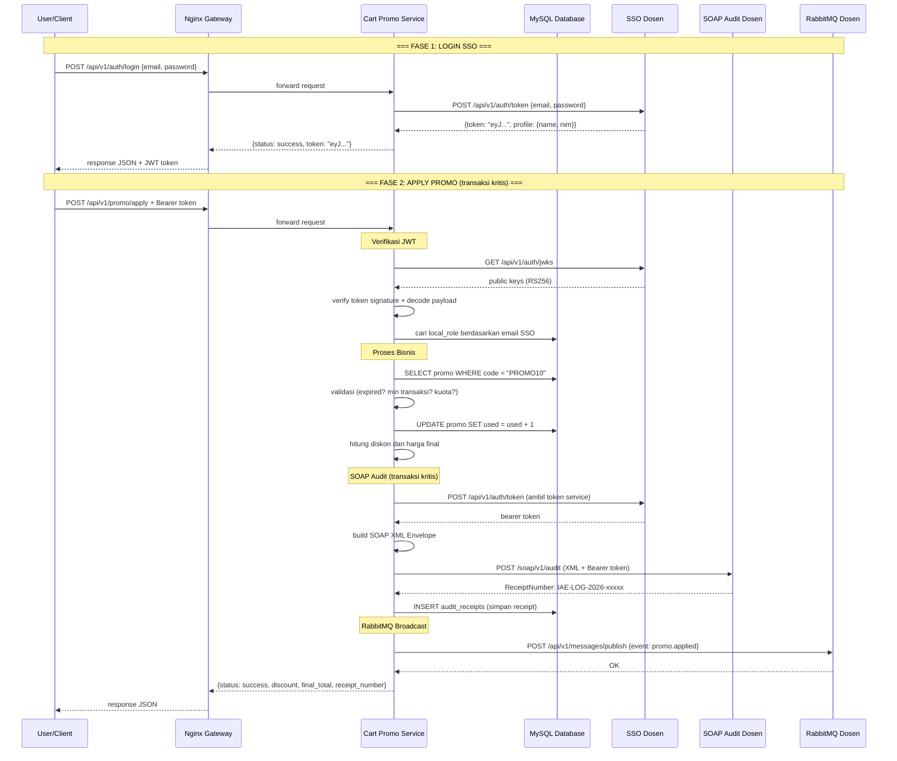
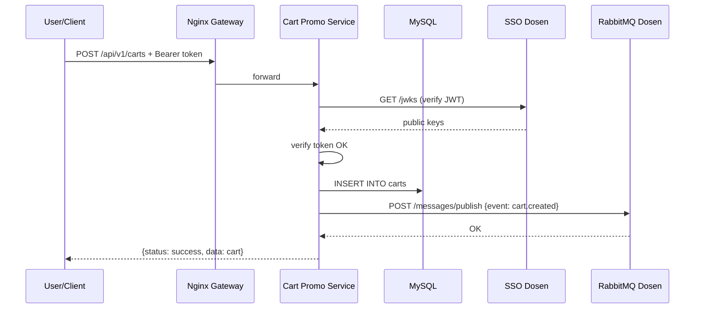

# Analisis Tugas 3 — Cart Promo Service

## Identifikasi Transaksi Kritis

Dari service Cart Promo yang sudah dibuat, ada beberapa transaksi yang terjadi di sistem. Setelah dianalisis, transaksi yang paling kritis dan perlu di-audit adalah **Apply Promo** (`POST /api/v1/promo/apply`).

Kenapa Apply Promo dianggap kritis:
- Transaksi ini mengubah state di database (field `used` pada tabel promo di-increment, jadi kuota promo berkurang)
- Melibatkan perhitungan keuangan (potongan harga dari total transaksi)
- Kalau terjadi kesalahan atau penyalahgunaan, bisa berdampak ke kerugian finansial (diskon yang tidak seharusnya)
- Termasuk kategori state-changing transaction yang melibatkan stok (kuota promo) dan keuangan (harga final)

Sedangkan untuk event yang perlu disebarkan ke seluruh departemen lewat RabbitMQ:
- `promo.applied` — saat promo berhasil dipakai, departemen lain perlu tau (misal untuk laporan marketing)
- `cart.created` — saat ada item masuk ke cart, untuk tracking aktivitas user
- `cart.deleted` — saat item dihapus dari cart

## Alur Interaksi dengan Layanan Terpusat

### 1. Alur Login SSO

User login ke sistem kita, tapi autentikasinya diverifikasi oleh SSO Dosen (bukan database lokal). Setelah dapat JWT token, kita verifikasi pakai public key (JWKS) dari server dosen juga. Lalu kita mapping email SSO ke tabel `local_roles` buat tentuin role user di sistem kita (admin/customer).

### 2. Alur SOAP Audit

Setiap kali transaksi Apply Promo berhasil, sistem kita bikin SOAP XML Envelope yang isinya data transaksi (kode promo, diskon, harga final), terus dikirim ke endpoint SOAP Audit dosen. Server dosen balikin `ReceiptNumber` sebagai bukti audit, yang kita simpan di tabel `audit_receipts`.

### 3. Alur RabbitMQ

Setiap transaksi penting (apply promo, create cart, delete cart) kita broadcast event-nya ke RabbitMQ dosen dalam format JSON. Ini sifatnya fire-and-forget, jadi kalau gagal kirim, transaksi utama tetap jalan normal.

## Sequence Diagram

### Alur Lengkap: Login → Apply Promo (SSO + SOAP + RabbitMQ)

### Alur Create Cart (RabbitMQ only)

## Komponen Teknis yang Diimplementasikan

### Modul 1: Federated SSO
- Login lewat endpoint SSO dosen, dapat JWT token (RS256)
- JWT di-verify pakai public key dari JWKS endpoint
- JWKS di-cache 1 jam supaya ga fetch terus-terusan
- Email dari JWT di-mapping ke tabel `local_roles` (role lokal: admin/customer)
- Middleware `jwt.auth` dipasang di semua endpoint cart & promo

### Modul 2: SOAP XML Client
- Transaksi Apply Promo otomatis kirim audit ke SOAP dosen
- Data JSON ditransformasi jadi XML SOAP Envelope (manual, tanpa PHP SOAP extension)
- Tag yang dipakai: `<TeamID>`, `<ActivityName>`, `<LogContent>` (CDATA berisi JSON)
- ReceiptNumber dari response dosen disimpan ke tabel `audit_receipts`

### Modul 3: AMQP Publisher
- Event dikirim ke RabbitMQ dosen lewat HTTP API (POST /api/v1/messages/publish)
- Event yang di-publish: `cart.created`, `cart.deleted`, `promo.applied`
- Pakai pola fire-and-forget (kalau gagal kirim, cuma di-log, transaksi utama tetap jalan)

### Modul 4: API Gateway
- Nginx sebagai reverse proxy di depan Laravel
- Semua traffic masuk lewat port 80 (Nginx)
- Port 8000 (Laravel) tidak bisa diakses langsung dari luar
- Ada rate limiting, security headers, dan CORS
