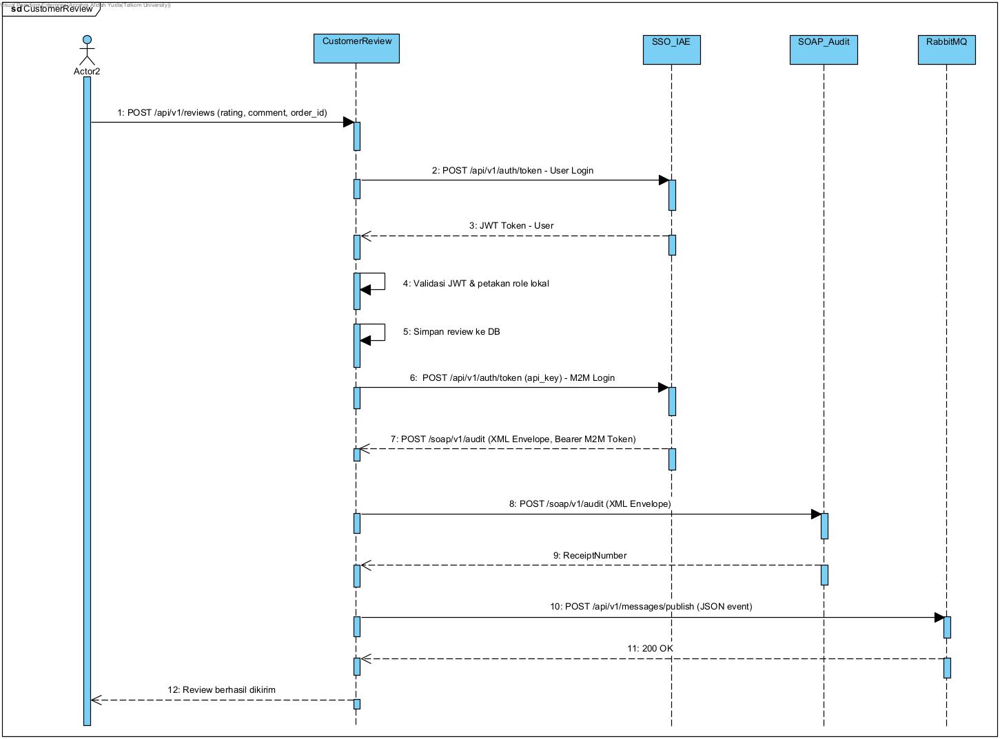

# Analisis Transaksi Kritis: Customer Review Service

## 1. Kenapa Transaksi Ini Kritis Banget?
- **Endpoint yang dinilai:** `POST /api/v1/reviews` (Buat submit review baru)
- **Alasannya:**
  1. **Ngaruh ke Bisnis:** Review dan rating itu ngaruh banget ke reputasi produk dan penjualan. Kalau ada review palsu atau manipulasi rating, perusahaan bisa rugi besar. Makanya, setiap data review yang masuk harus terekam sah dan bisa dipertanggungjawabkan.
  2. **Karakteristik Perubahan Status:** Transaksi ini menghasilkan perubahan data secara permanen di dalam sistem. Setelah ulasan dikirimkan, data tersebut akan langsung tercatat sebagai ulasan publik dan tidak dapat dibatalkan secara sepihak oleh pengguna tanpa adanya proses peninjauan langsung dari tim pengelola (moderator).
  3. **Efek Domino:** Satu review baru tuh bisa memicu kerjaan di service lain. Contohnya, *Product Service* harus ngitung ulang rata-rata rating produk, atau *Notification Service* harus ngirim email ke penjual. Jadi, transaksi ini jadi *trigger* awal buat proses bisnis *end-to-end* yang lebih luas.

---

## 2. Skema Login & Role Mapping (SSO Pusat)
Karena kita pakai konsep *microservices*, aplikasi Review kita gak ngecek password sendiri. Urusan autentikasi diserahin ke **Cloud Pusat (SSO Dosen)**.

**Gimana alurnya?**
1. Aplikasi kita ngirim email & password user ke endpoint SSO Pusat (`https://iae-sso.virtualfri.id/api/v1/auth/token`).
2. Kalau login sukses, Pusat bakal ngasih balikan berupa token JWT.
3. Aplikasi kita bakal ngebongkar (*decode*) isi JWT itu buat ngambil data user, kayak identitas (`sub`), `email`, dan `role`.
4. Terus, data dari JWT itu kita simpan dan kita petakan (*mapping*) ke tabel database lokal kita (`user_roles`).
5. Kalau dari JWT pusat ternyata gak ngasih info role, sistem kita bakal otomatis nge-set role default lokal sebagai `'customer'`.
6. **Tujuannya:** Biar aplikasi kita punya kontrol otorisasi sendiri (RBAC) dan tau siapa yang lagi ngakses, tanpa harus capek-capek *request* ke server pusat terus buat nanya "ini user siapa sih?".

---

## 3. Validasi & Catatan Audit (SOAP XML Client)
Karena ulasan produk itu punya implikasi hukum dan bisnis, kita butuh jaminan kalau transaksi ini beneran sah dan gak bisa disangkal (*Non-repudiation*).

- **Cara kerjanya:** Tiap kali ada review yang sukses masuk ke database lokal, data reviewnya (kayak ID produk, nama, rating, komentar) bakal dibungkus ke dalam format XML Envelope yang lumayan kaku (pakai protokol SOAP).
- Biar aman kirimnya, kita pakai token khusus mesin-ke-mesin (*M2M Token*).
- Setelah dikirim, server SOAP Pusat bakal ngasih balasan berupa `<iae:ReceiptNumber>` (semacam nomor resi). Nah, nomor resi ini wajib kita simpan ke tabel `audit_logs` lokal sebagai bukti kuat (struk) kalau aktivitas "CustomerReviewSubmitted" ini udah tercatat dan diakui sama Infrastruktur Pusat.

---

## 4. Sebarin Event via RabbitMQ (AMQP Publisher)
Tadi kan dibilang kalau review baru bisa memicu efek domino. Tapi, kalau kita ngasih tau service lain dengan cara manggil API mereka satu-satu secara nungguin (*synchronous*), aplikasi kita bakal lemot dan gampang error (terlalu *tightly coupled*).

- **Solusinya:** Kita pakai **RabbitMQ** sebagai perantara pesan (*Message Broker*).
- **Cara kerjanya:** Begitu review kelar disimpen dan dicatat auditnya, aplikasi kita bakal nge-publish event berformat JSON ke endpoint RabbitMQ Dosen pakai `routing_key` = `review.submitted`.
- **Keuntungannya:** Aplikasi kita bisa langsung ngasih balasan cepat `201 Created` ke *user* yang nulis ulasan, tanpa harus nungguin service lain kelar kerja. Service lain yang butuh info soal review baru ini tinggal langganan (*subscribe*) aja ke RabbitMQ secara asinkron (*background*).

---

## 5. Sequence Diagram Interaksi Eksternal
Ini gambaran alur sekuensial gimana aplikasi Review kita ngobrol sama tiga layanan eksternal dari dosen (SSO, SOAP, dan RabbitMQ).

