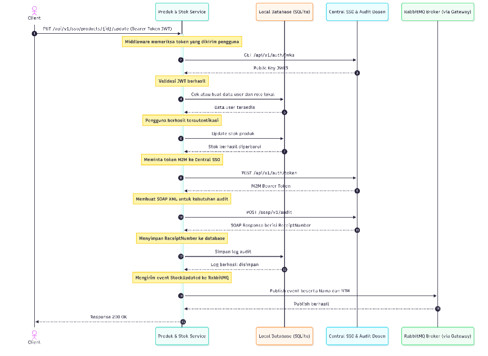

Nama: Sepdaffa Raja
NIM: 102022400191
Service: Produk & Stok Service (Group 1)

1. Penjelasan Transaksi Penting dan Penyebaran Event

Pada sistem E-Commerce yang dibangun menggunakan arsitektur terdistribusi, transaksi Update Stok Produk dipilih sebagai transaksi utama karena transaksi ini mengubah data yang ada di sistem dan berpengaruh langsung terhadap proses bisnis.

A. Transaksi Penting untuk Audit Terpusat (SOAP/XML)

Perubahan stok produk termasuk proses yang penting karena jumlah stok menentukan apakah suatu produk masih bisa dibeli atau tidak. Jika data stok tidak sesuai atau terjadi kesalahan saat pembaruan, dapat menimbulkan masalah seperti produk terjual melebihi stok yang tersedia maupun kehilangan peluang penjualan.

Untuk mencatat setiap perubahan stok, sistem mengirimkan data transaksi ke Sistem Audit Terpusat (SSO/Audit Dosen) menggunakan format SOAP berbasis XML. SOAP dipilih karena memiliki struktur data yang jelas dan banyak digunakan pada sistem yang membutuhkan pencatatan transaksi secara formal dan konsisten.

Setelah data audit berhasil dikirim, sistem menerima ReceiptNumber dari layanan audit. Nomor tersebut kemudian disimpan sebagai bukti bahwa aktivitas perubahan stok telah berhasil dicatat pada sistem audit terpusat.

B. Penyebaran Aktivitas Bisnis Menggunakan RabbitMQ

Perubahan stok tidak hanya berdampak pada layanan produk saja, tetapi juga dapat memengaruhi layanan lain dalam sistem. Sebagai contoh, layanan pemesanan membutuhkan informasi stok terbaru saat proses checkout, sedangkan layanan notifikasi dapat menggunakan informasi tersebut untuk memberikan peringatan jika stok produk mulai menipis.

Agar informasi perubahan stok dapat diterima oleh layanan lain dengan lebih efisien, sistem mengirim event StockUpdated melalui RabbitMQ menggunakan exchange iae.central.exchange.

Dengan pendekatan ini, layanan produk cukup mengirimkan event ke message broker tanpa harus menunggu proses dari layanan lain selesai. Cara ini membuat komunikasi antar layanan menjadi lebih fleksibel dan membantu menjaga performa sistem.

2. Sequence Diagram Internal

Berikut merupakan gambaran alur proses ketika pengguna melakukan pembaruan stok produk, mulai dari validasi autentikasi, pembaruan data, pencatatan audit, hingga pengiriman event ke RabbitMQ.

Diagram di atas menunjukkan bahwa setiap perubahan stok tidak hanya memperbarui data pada database lokal, tetapi juga dicatat ke sistem audit terpusat dan disebarkan ke layanan lain melalui RabbitMQ. Dengan proses tersebut, data antar layanan dapat tetap sinkron dan aktivitas penting tetap terdokumentasi dengan baik.